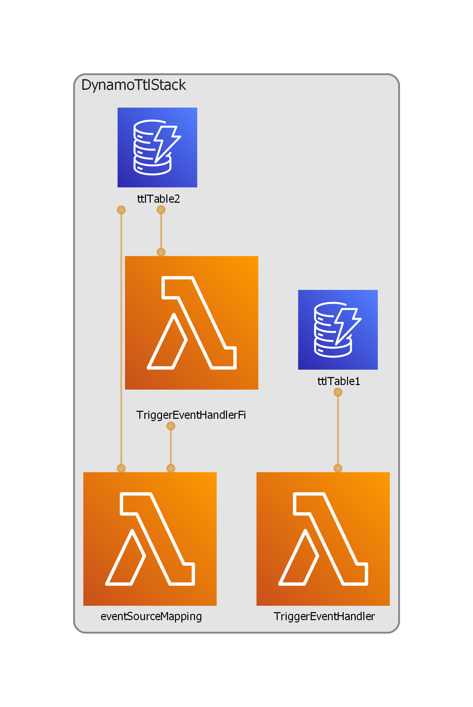

# AWS CDK DynamoDB TTL

[Click to read the blog post on GreenChapel.dev](https://greenchapel.dev/2022/08/28/catch-dynamodb-ttl-delete-item-event/)

## Project commands

* `npm run build`    to build the project and the project diagram
* `npm run deploy`   deploy all the stacks in this project to the default AWS account
* `npm run destroy`  take down all the stacks generated in this project

## Useful commands

* `npm run build`   compile typescript to js
* `npm run watch`   watch for changes and compile
* `npm run test`    perform the jest unit tests
* `cdk deploy`      deploy this stack to your default AWS account/region
* `cdk diff`        compare deployed stack with current state
* `cdk synth`       emits the synthesized CloudFormation template
